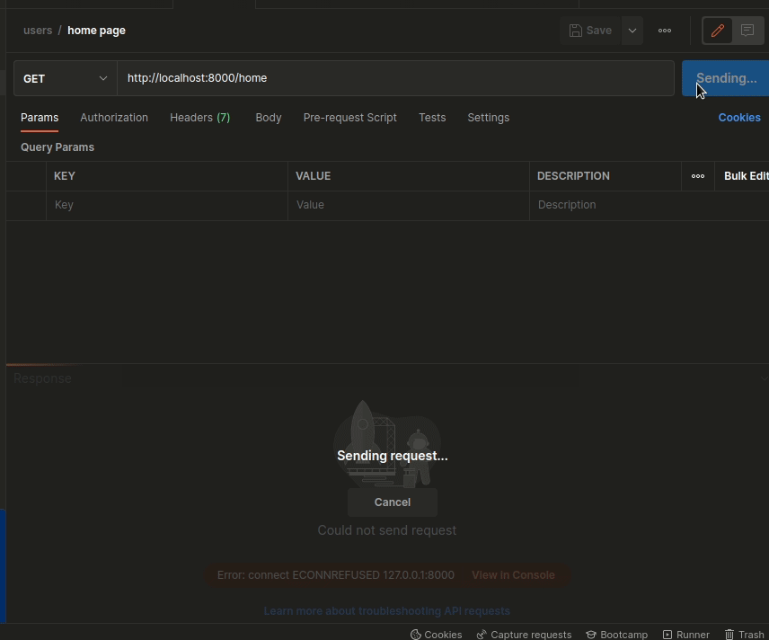

# NodeJS WEB API DEMO

## Table of contents

- [Overview](#overview)
    - [Screenshot](#screenshot)
    - [Built with](#built-with)
    - [Libraries](#Libraries)
- [Author](#authors)

## Overview

### GIF

(<a href="#top">back to top</a>)

### Built with

* [NodeJS](https://nodejs.dev/)

(<a href="#top">back to top</a>)

### Libraries

* [npm](https://www.npmjs.com/)
* [nodemon](https://www.npmjs.com/package/nodemon)

(<a href="#top">back to top</a>)

## Authors

* LinkedIn - [Abdullah Hegab](https://www.linkedin.com/in/hegab192/)

(<a href="#top">back to top</a>)
