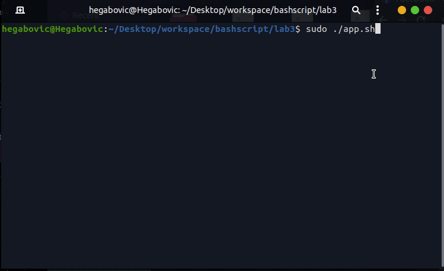

# Bash Script Menu Demo 

creating a bash script to preform a CRUD operation on mysql database

## Table of contents

- [Overview](#overview)
    - [Screenshot](#screenshot)
    - [Built with](#built-with)
- [Author](#authors)

## Overview

### GIF

(<a href="#top">back to top</a>)

### Built with

* [bash script](https://www.php.net/)

(<a href="#top">back to top</a>)

## Authors

* LinkedIn - [Hegabovic](https://www.linkedin.com/in/hegab192)

(<a href="#top">back to top</a>)
